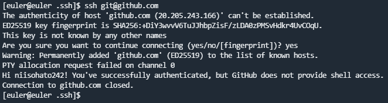
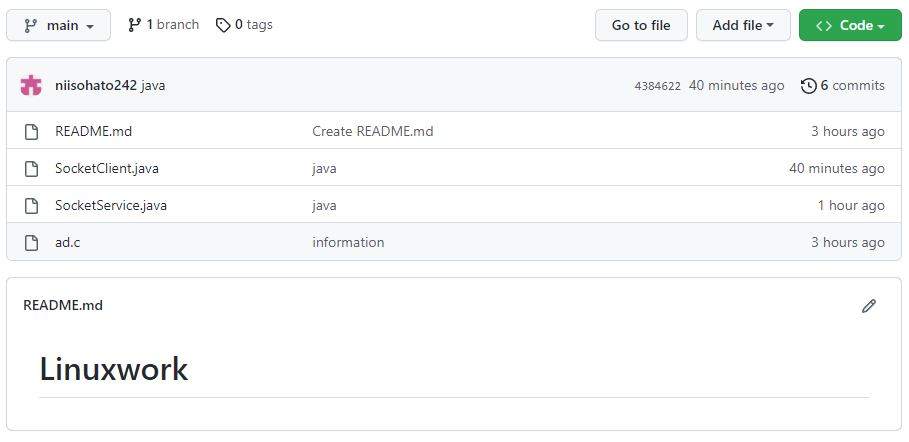
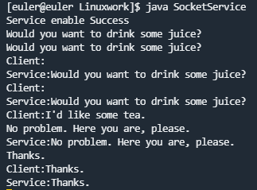
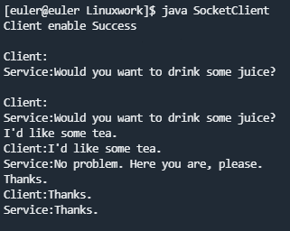
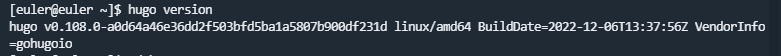

## 大作业完成情况
### 1.安装git
通过网上相关资料的学习，我学习了GitHub网站的作用，并认识了GitHub创建仓库、在本地创建仓库并将本地仓库和远程仓库相连。

* 下载git命令：`sudo yum install git`
* git_ssh的配置和使用:

		git config --global user.name "YAO"	//配置用户名
		git config --global user.email "2420006310@qq.com" //配置用户邮件
		ssh-keygen -t rsa -C "2420006310@qq.com" //生成密钥

连接成功如下：

在配制完两端的仓库后，可以成功实现两端数据的同步和修改。

	echo "# Linuxwork" >>README.md //对远程仓库文件做修改
	git add README.md //将修改文件提交至缓存区
	git commit -m "first" //同步到本地仓库
	git branch -M main //修改分支名
	git remote add origin https://github.com/niisohato242/Linuxwork.git //添加远程仓库
	git push -u origin main //远程仓库更新
	

如图：

### 2.Socket

在Linux下，利用 socket 技术编写程序，使用Java语言实现客户端和服务端两者之间的信息传递。

下载Linux的Java版本并解压：
`wget https://download.oracle.com/java/19/latest/jdk-19_linux-x64_bin.tar.gz`

在.bash_profile文件配置环境变量：

	export  JAVA_HOME=~/java/jdk19.0.1	
	export JRE_HOME=~/java/jdk19.0.1/jre 	
	export CLASSPATH=.:$JAVA_HOME/LIB/DT.JAR:$JAVA_HOME/lib/tools.jar:$JAVA_HOME/lib:$CLASSPATH 	
	export PATH=$JAVA_HOME/bin:$PATH 

就可以进行Java文件的编译运行。

	// 服务端
	import java.io.BufferedReader;
	import java.io.IOException;
	import java.io.InputStreamReader;
	import java.io.PrintWriter;
	import java.net.ServerSocket;
	import java.net.Socket;
	 
	public class SocketService {    //搭建服务器端
	    public static void main(String[] args) throws IOException{
	        SocketService socketService = new SocketService();
	        //1、a)创建一个服务器端Socket，即SocketService
	        socketService.oneServer();
	    }
	    public  void oneServer(){
	        try{
	            ServerSocket server=null;
	            try{
	                //下面是端口，端口可以和客户端代码里面的端口一样
	                server=new ServerSocket(5209);
	                //b)指定绑定的端口，并监听此端口。
	                System.out.println("Service enable Success");
	                //创建一个ServerSocket在端口5209监听客户请求
	            }catch(Exception e) {
	                System.out.println("No Listen："+e);
	                //出错，打印出错信息
	            }
	            Socket socket=null;
	            try{
	                socket=server.accept();
	                //2、调用accept()方法开始监听，等待客户端的连接
	                //使用accept()阻塞等待客户请求，有客户
	                //请求到来则产生一个Socket对象，并继续执行
	            }catch(Exception e) {
	                System.out.println("Error."+e);
	                //出错，打印出错信息
	            }
	            //3、获取输入流，并读取客户端信息
	            String line;
	            BufferedReader in=new BufferedReader(new InputStreamReader(socket.getInputStream()));
	            //由Socket对象得到输入流，并构造相应的BufferedReader对象
	            PrintWriter writer=new PrintWriter(socket.getOutputStream());
	            //由Socket对象得到输出流，并构造PrintWriter对象
	            BufferedReader br=new BufferedReader(new InputStreamReader(System.in));
	            //由系统标准输入设备构造BufferedReader对象
	            System.out.println("Client:"+in.readLine());
	            //在标准输出上打印从客户端读入的字符串
	            line=br.readLine();
	            //从标准输入读入一字符串
	            //4、获取输出流，响应客户端的请求
	            while(!line.equals("end")){
	                //如果该字符串为 "bye"，则停止循环
	                writer.println(line);
	                //向客户端输出该字符串
	                writer.flush();
	                //刷新输出流，使Client马上收到该字符串
	                System.out.println("Service:"+line);
	                //在系统标准输出上打印读入的字符串
	                System.out.println("Client:"+in.readLine());
	                //从Client读入一字符串，并打印到标准输出上
	                line=br.readLine();
	                //从系统标准输入读入一字符串
	            } //继续循环
	            
				//5、关闭资源
	            writer.close(); //关闭Socket输出流
	            in.close(); //关闭Socket输入流
	            socket.close(); //关闭Socket
	            server.close(); //关闭ServerSocket
	        }catch(Exception e) {//出错，打印出错信息
	            System.out.println("Error."+e);
	        }
	    }
	}

###

	//客户端
	import java.io.BufferedReader;
	import java.io.IOException;
	import java.io.InputStream;
	import java.io.InputStreamReader;
	import java.io.PrintWriter;
	import java.net.InetAddress;
	import java.net.Socket;
	import java.net.URL;
	 
	public class SocketClient {
	 
	    // 搭建客户端
	    public static void main(String[] args) throws IOException {
	        try {
	            // 1、创建客户端Socket，指定服务器地址和端口
	 
	            //下面是你要传输到另一台电脑的IP地址和端口
	            Socket socket = new Socket("192.168.56.108", 5209);
	            System.out.println("Client enable Success");
	            // 2、获取输出流，向服务器端发送信息
	            // 向本机的52000端口发出客户请求
	            BufferedReader br = new BufferedReader(new InputStreamReader(System.in));
	            // 由系统标准输入设备构造BufferedReader对象
	            PrintWriter write = new PrintWriter(socket.getOutputStream());
	            // 由Socket对象得到输出流，并构造PrintWriter对象
	            //3、获取输入流，并读取服务器端的响应信息
	            BufferedReader in = new BufferedReader(new InputStreamReader(socket.getInputStream()));
	            // 由Socket对象得到输入流，并构造相应的BufferedReader对象
	            String readline;
	            readline = br.readLine(); // 从系统标准输入读入一字符串
	            while (!readline.equals("end")) {
	                // 若从标准输入读入的字符串为 "end"则停止循环
	                write.println(readline);
	                // 将从系统标准输入读入的字符串输出到Server
	                write.flush();
	                // 刷新输出流，使Server马上收到该字符串
	                System.out.println("Client:" + readline);
	                // 在系统标准输出上打印读入的字符串
	                System.out.println("Service:" + in.readLine());
	                // 从Server读入一字符串，并打印到标准输出上
	                readline = br.readLine(); // 从系统标准输入读入一字符串
	            } // 继续循环
	            //4、关闭资源
	            write.close(); // 关闭Socket输出流
	            in.close(); // 关闭Socket输入流
	            socket.close(); // 关闭Socket
	        } catch (Exception e) {
	            System.out.println("can not listen to:" + e);// 出错，打印出错信息
	        }
	    }
	 
	}

运行结果如图：

* 服务端

* 客户端

### 3.hugo

使用Hugo生成静态网站，首先下载并配置好相关环境。

使用Markdown语法编写网站内容，将这些md文件生成静态网站，部署到Linux虚拟机的Nginx服务器上。